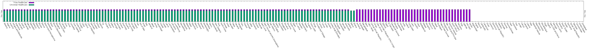

# Displaying List of countries with universal health care

Data taken from [Wikipedia](https://en.wikipedia.org/wiki/List_of_countries_with_universal_health_care)

If you have a good way to visualize this, please feel free to fork, send some pull requests, etc.  Add the alternative methods to the Makefile, if you would.

## Notes:

1. The columns for each country were originally just 0 and 1.  I set them to other to make one (Universal vs. Free) different heights.  It's not ideal.
